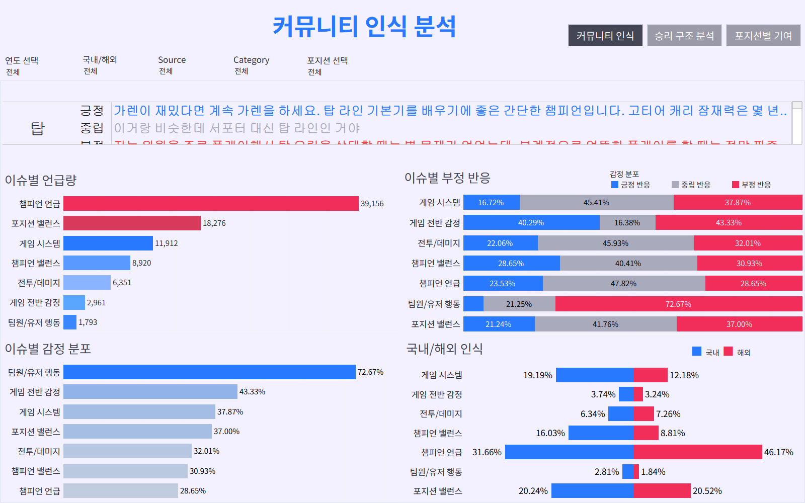
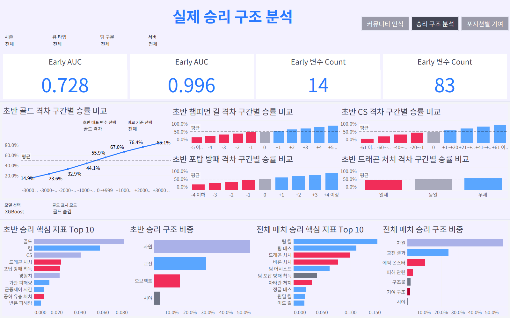
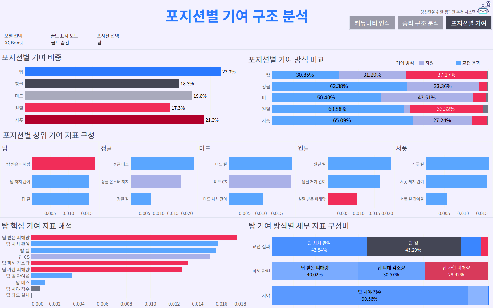
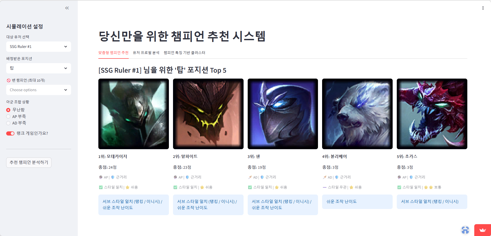
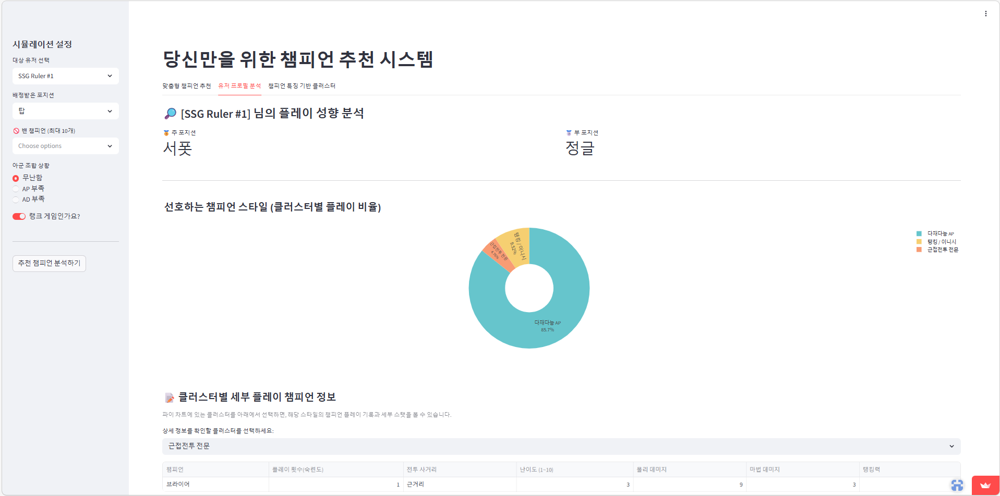
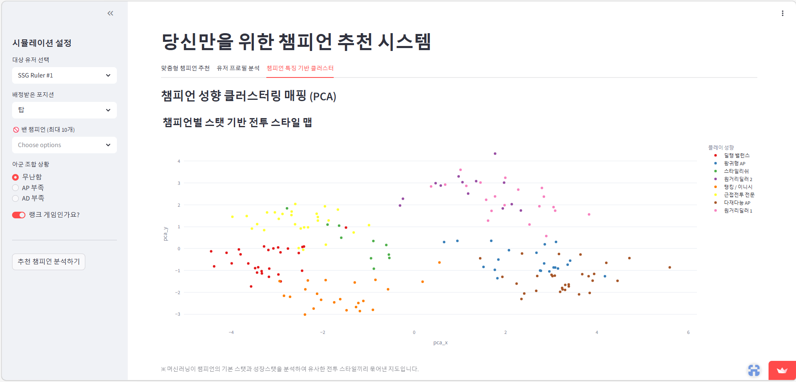

# Project_LastDance 
### League of Legends Win Structure Analysis

League of Legends 데이터 기반으로 **승리 기여 구조 해석 및 유저 경험 개선 전략을 제안하는** 프로젝트입니다.


Python / Riot API / XGBoost / LightGBM / SHAP / Tableau

---

🇰🇷 한국어  -> README.md 

🇺🇸 English -> README_EN.md

---

## 대시보드 Preview

커뮤니티 인식과 실제 경기 데이터를 비교 분석하여 승리 구조와 포지션별 기여를 Tableau로 시각화하고

추천 시스템을 Streamlit으로 시각화하였습니다.

https://public.tableau.com/app/profile/.32296278/viz/LoL_17732259346840/sheet0

<p align="center">
  
  
  
  
  
  
</p>

---

## 프로젝트 개요

리그 오브 레전드 커뮤니티에서는 다음과 같은 의견이 반복적으로 등장합니다.

"정글 차이로 게임이 터진다"  
"서폿은 기여가 잘 보이지 않는다"  
"라인전보다 시스템 영향이 더 큰 것 같다"

하지만 이러한 **유저 체감이 실제 경기 데이터와 일치하는지**는 명확하지 않습니다.

이 프로젝트는

커뮤니티 인식 -> 실제 경기 데이터 -> 승리 구조

의 관계를 분석하여 **게임 승리를 설명하는 구조적 요인**을 분석합니다.

---

## 프로젝트 아키텍처

```

[Game Data (Riot API)]

match-v5
timeline-v5
        │
        ▼
Match Event Data
        │
        ▼
Champion Metadata
(Data Dragon)
        │
        ▼
Feature Engineering
        │
        ▼
Exploratory Data Analysis
        │
        ▼
Machine Learning Models
=================================================================================================================================

[Community Data (Reddit / YouTube)]

Reddit (Web Crawling)
YouTube (Youtube API)
        │
        ▼
Comment Processing
Translation (Google Translation API)
        │
        ▼
Community Perception Analysis
=================================================================================================================================

[Machine Learning (XGBoost,LightGBM)]

Early Game Model
Full Game Model
        │
        ▼
Model Explainability

SHAP Analysis
        │
        ▼
Match Structure Classification

COMEBACK
THROW
STOMP
NEUTRAL
        │
        ▼
Tableau Dashboards

1. Community Perception
2. Win Structure Analysis
3. Position Contribution
```

---

## 데이터 수집

### Riot API

사용 API

- match-v5
- timeline-v5

수집 데이터

- match metadata
- participant statistics
- timeline events

---

### Champion Metadata

챔피언 데이터는 **Data Dragon**을 통해 수집했습니다.

포함 정보

- champion id
- champion name
- champion role
- champion stats

---

### Community Data

커뮤니티 인식을 분석하기 위해 댓글 데이터를 수집했습니다.

데이터 출처

- Reddit 댓글 (웹 크롤링)
- YouTube 댓글 (YouTube API)

---

### Translation

영어권 댓글 데이터는 **Google Cloud Translation API**를 통해 번역했습니다.

---

## Data 규모

수집 대상  
Riot API 기반 **15개 서버** 랭크 유저 및 매치 데이터

수집 범위  
**시즌 15.1 ~ 16.2**의 15개 서버 랭크 5:5 매치 데이터

데이터 규모  
**유저** 약 765만 명 → 0.2% 샘플 **약 15,000명**  
**매치** 약 573만 경기 → 2% 샘플 **약 114,000경기**

수집 지표  
매치 승패와 관련된 주요 플레이 및 오브젝트 지표

---

## 탐색적 데이터 분석 (EDA)

EDA 단계에서는 다음 분석을 수행했습니다.

- 주요 변수 분포
- 초반 격차와 승률 관계
- 열세 구간과 역전 가능성
- 포지션별 주요 지표

---

## 머신러닝 모델

경기 승리 확률을 예측하기 위해 **트리 기반 머신러닝 모델**을 사용했습니다.

사용 모델

- XGBoost
- LightGBM

모델 구성

Early Game Model  
-> 초반 게임 상태 기반 승리 확률 예측

Full Game Model  
-> 전체 경기 데이터를 기반으로 승리 확률 예측

---

## 모델 해석

모델 해석을 위해 **SHAP**을 사용했습니다.

분석 내용

- Feature Importance
- 승리 확률 영향
- 경기 구조 해석

---

## 경기 구조 분류

초반 상황과 최종 결과를 기반으로 경기를 분류했습니다.

COMEBACK  
THROW  
STOMP_WIN  
STOMP_LOSS  
NEUTRAL  

이를 통해

- 역전 경기 구조
- 초반 격차 영향
- 승리 패턴

을 분석했습니다.

---

## Tableau 대시보드

분석 결과는 Tableau로 시각화했습니다.

1. Community Perception Dashboard  
2. Win Structure Analysis Dashboard  
3. Position Contribution Dashboard  

---

## 기술 스택

**Language**
- Python

**Library**
- pandas
- numpy
- scikit-learn
- xgboost
- lightgbm
- shap
- matplotlib

**API**
- Riot API
- YouTube API
- Google Translation API

**Visualization**
- Tableau
- Streamlit

---

## Repository Structure

```
project
 ├ code
 │   ├ 01_Riot_API
 │   ├ 02_Comment
 │   ├ 03_Analysis_pipeline
 │   ├ 04_Streamlit_dashboard
 │   └ ETC
 │
 ├ images
 │   └ images
 │ 
 ├ .gitignore
 ├ MIT LICENSE
 └ README.md
```
