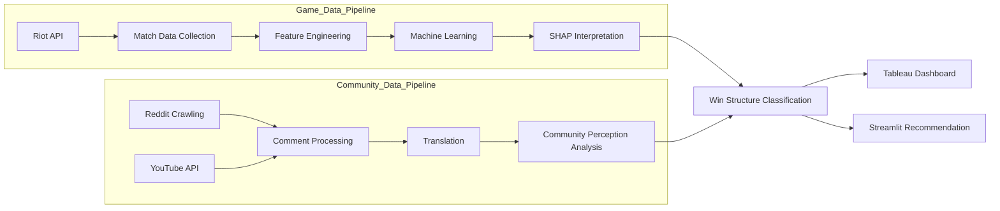

# Project_LastDance

### League of Legends Win Structure Analysis

A data analysis project that analyzes League of Legends match data to
**interpret the contribution structure of winning and propose strategies to improve player experience.**

---

## 🌐 Language

- 🇰🇷 [Korean](README.md)
- 🇺🇸 [English](README_EN.md)

---

## 📊 Dashboard Preview

Community perception and actual match data were comparatively analyzed to visualize
the win structure and position-based contribution using Tableau.

The recommendation system was implemented as an **interactive dashboard using Streamlit**.

Tableau Dashboard
https://public.tableau.com/app/profile/.32296278/viz/LoL_17732259346840/sheet0

<p align="center">
  
  
  
</p>

<p align="center">
  
  
  
</p>

---

## 🎯 Project Overview

In the League of Legends community, the following opinions frequently appear.

"Jungle gap decides the game."
"Support contribution is hard to see."
"It feels like the system matters more than the laning phase."

However, it is not clear whether **these player perceptions actually match real match data**.

This project analyzes the relationship between

**Community Perception → Match Data → Win Structure**

to identify **structural factors that explain victory in the game.**

---

## 🏗 Project Architecture



---

## 📦 Data Sources

| Source           | Data Type    | Role                       |
| ---------------- | ------------ | -------------------------- |
| Riot API         | Quantitative | Match data, model training |
| Data Dragon      | Metadata     | Champion metadata          |
| Reddit / YouTube | Qualitative  | Community perception       |

---

## 🔄 Data Collection

### Riot API

APIs used

* match-v5
* timeline-v5

Collected data

* match metadata
* participant statistics
* timeline events

---

### Champion Metadata

Champion metadata was collected using **Data Dragon**.

Included information

* champion id
* champion name
* champion role
* champion stats

---

### Community Data

Comment data was collected to analyze community perception.

Data sources

* Reddit (Web Crawling)
* YouTube (YouTube API)

---

### Translation

English comments were translated using the **Google Cloud Translation API**.

---

## 📈 Data Scale

Collection target
Ranked users and match data from **15 Riot servers**

Collection range
**Season 15.1 ~ 16.2**

| Category | Raw Data | Sample |
| -------- | -------- | ------ |
| Users    | 7.65M    | 15K    |
| Matches  | 5.73M    | 114K   |

Collected metrics

* match results
* player statistics
* objective events

---

## ⚙️ Feature Engineering

Based on EDA results, **key features explaining match outcomes were designed.**

### Player Performance Features

Player performance metrics

* Gold Earned
* Damage Dealt
* Damage per Minute
* Gold per Minute
* Deaths
* Vision Score

---

### Team Level Features

Team-level match indicators

* Total Team Gold
* Team Damage
* Team Kills
* Objective Control
* Tower Damage

---

### Timeline Features

Indicators reflecting match flow

* Early Game Gold Difference
* Early Game Kill Difference
* Objective Timing
* Early Death Count

---

### Position Based Features

Metrics reflecting positional roles

* Jungle Objective Participation
* Support Vision Contribution
* Carry Damage Share

---

### Match Context Features

Contextual indicators explaining match conditions

* Game Duration
* Gold Difference
* Kill Difference
* Objective Difference

---

### Feature Selection

Before model training, features were refined through the following processes:

* Correlation Analysis
* Feature Importance
* SHAP-based feature impact analysis

This process created a **feature set that enables model interpretability.**

---

## 🔍 Exploratory Data Analysis

EDA was conducted not just for data summarization,
but as a step to **define the feature structure for modeling and interpretation.**

### Key Analysis Areas

1️⃣ Match Structure
2️⃣ Position Performance
3️⃣ Feature – Win Relationship
4️⃣ Timeline Flow
5️⃣ Performance Variance
6️⃣ Player Behavior

---

## 🤖 Machine Learning Models

**Tree-based models** were used to predict match win probability.

### Models

* XGBoost
* LightGBM

### Model Types

Early Game Model
→ Predicts win probability based on early-game state

Full Game Model
→ Predicts win probability based on full match data

---

## 🧠 Model Explainability

**SHAP** was used for model interpretation.

Analysis included

* Feature importance
* Win probability impact
* Match structure interpretation

---

## 🏆 Match Structure Classification

Matches were classified based on early game status and final results.

| Type       | Description              |
| ---------- | ------------------------ |
| COMEBACK   | Early disadvantage → Win |
| THROW      | Early advantage → Loss   |
| STOMP_WIN  | Dominant win             |
| STOMP_LOSS | Dominant loss            |
| NEUTRAL    | Balanced match           |

---

## 📊 Tableau Dashboards

The analysis results were visualized using Tableau.

1️⃣ Community Perception
2️⃣ Win Structure Analysis
3️⃣ Position Contribution

---

## 🛠 Tech Stack

### Language

* Python

### Libraries

* pandas
* numpy
* scikit-learn
* xgboost
* lightgbm
* shap

### APIs

* Riot API
* YouTube API
* Google Translation API

### Visualization

* Tableau
* Streamlit

---

## 📁 Repository Structure

```
project
 ├ code
 │   ├ 01_Riot_API
 │   ├ 02_Comment
 │   ├ 03_Analysis_pipeline
 │   ├ 04_Streamlit_dashboard
 │   └ ETC
 │
 ├ images
 │
 ├ .gitignore
 ├ LICENSE
 ├ README.md
 └ README_EN.md
```

---

## 📌 Key Insight

This project integrates

* community perception analysis
* real match data analysis
* machine learning–based win structure interpretation

to present a **data-driven structural model explaining victory in League of Legends.**
